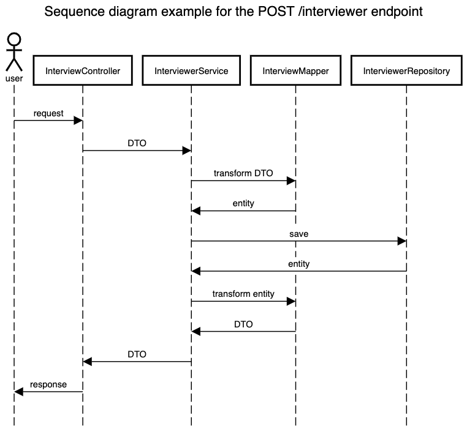

# Calendar API

Calendar API is a simple API to create and match slots between interviewers and candidates. 

It's built in Java 11 with Spring boot.

## How to install it and run it locally?

To run the application locally, you must have Docker installed.
Then, you can simply run `docker-compose up --build`, this will run tests and get the application up and running. 
The API will be available on port `8081`.

If you like, you can start only the API using
 - `docker-compose build app && docker-compose up app`

or you can run only the tests suit using 
 - `docker-compose build tests && docker-compose run tests`


It's also possible to connect directly to the database instance (while the app is running)
by using some database client (e.g. DBeaver) using the following parameters:
 - host: `localhost`
 - port: `5433`
 - database: `myappdatabase`
 - username: `admin`
 - password: `admin`

These are the default values defined in the docker-compose file.

## API Docs

The API documentation is available at [this page](https://documenter.getpostman.com/view/15348183/VUjMnQpC).
There you can find all the available endpoints and examples of requests/responses.

## Project structure

The main structure of the project is organized as the tree bellow:
```
└── code
    └── thiago
        └── app
            ├── controller
            ├── dto
            ├── exceptions
            │   └── handler
            ├── interfaces
            ├── mapper
            ├── model
            ├── repository
            └── service
```

And the flow of the requests is a basic `Controller ➜ Service ➜ Repository`, like the following example:

